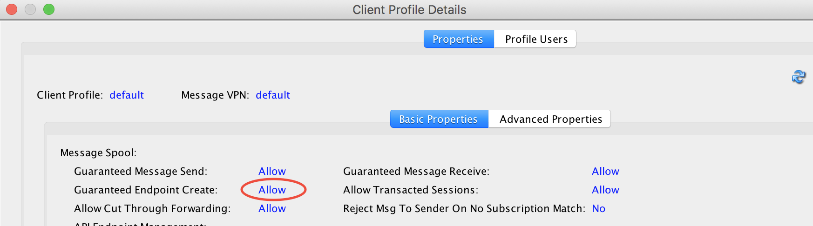

# Kafka Connect Solace Source Connnector

A Kafka Connect *source* which listens to messages on a Solace topic and forwards them to a Kafka topic

## Getting Started

These instructions will get you a copy of the project up and running on your local machine for development and testing purposes. See [deployment](#deployment) for notes on how to deploy the project on a live system.

### Prerequisites

ZooKeeper and Kafka.You need both a Solace Message Router and a Kafka environment. 

If you don't have a physical Solace Appliance available to you then use either a Virtual Message Router [VMR](http://dev.solace.com/downloads/) or register on [Solace's messaging as a service](https://datago.io).

In order to connect to the Solace message router you need a number of parameters

Parameter       | Description
--------------- | -------------
solace.smfHost  | ipaddress or host name of the Solace Router. If the SMF interface on the router is not running on the standard port (55555) then append the port number as well e.g. `127.0.0.1:55559`|
solace.msgVpn   | the message VPN to connect to on the Router. Optional, if not provided `default` is used.
solace.username | identity to use to connect to the Router. Optional, if not provided `default` is used.
solace.password | password, may be empty
solace.topic    | The Solace topic to listen on. May contain wildcards, eg `test/>`.

In order to successfully run the Unit Tests for the Connector you need to edit the `src/test/resources/unit_test.properties` file and provide the correct values for your environment.

See [here](docs/source_config_options.rst) for a complete list of all configuration parameters used by the Connector. 

### Getting the source

Grab a copy of the project using `git clone` from  [GitHub](https://github.com/MichaelHussey/SolaceKafkaSourceConnector)

If you want to easily import the source into Eclipse (in order to inspect or modify) there is a Gradle task which generates a .project file with correctly configured source and classpaths

```
./gradlew eclipse
```

Then simply use `File | Import... | Existing Projects into Workspace` in the IDE

## Building and testing

Make sure that the `config/unit_test.properties` file is up-to-date.

It's possible to just build the code and run the Unit Tests on their own - using Gradle...

```
./gradlew compile
./gradlew test
```

...or using Maven

```
mvn compile
mvn test
```

The Kafka Connect architecture requires a jar file which can be created in Gradle via

```
./gradlew build
```
Note that this also runs the UnitTests. Just `./gradlew assemble` will create the jar file without running the tests. To run the unit tests and create the jar file in Maven use

```
./mvn package
```
Both Gradle and Maven create `target/solace_kafka_source-0.1.jar` and also copy the run-time dependencies (except those provided by Kafka Connect itself) into `target/deplib/`

### (#deployment) Deploying the Connector into Kafka

The simplest way to copy the jar file created above together with the required dependencies to a directory which is contained in the Kafka environment's `plugin.path` [See docs for the Confluent Platform](http://docs.confluent.io/current/connect/userguide.html#installing-plugins). 

```
export SOLACE_KAFKA_PLUGIN=${CONFLUENT_HOME}/share/java/kafka-connect-solace
mkdir ${SOLACE_KAFKA_PLUGIN}
cp target/solace_kafka_source-0.1.jar ${SOLACE_KAFKA_PLUGIN}/
cp target/deplib/* ${SOLACE_KAFKA_PLUGIN}/
```

### Starting the connector

First start the Kafka environment. For the purposes of testing a stand-alone [Confluent](https://www.confluent.io/download/) install is sufficient. In different consoles start ZooKeeper

```
cd ${CONFLUENT_HOME}
bin/zookeeper-server-start etc/kafka/zookeeper.properties
```
and a Kafka Server

```
cd ${CONFLUENT_HOME}
bin/kafka-server-start etc/kafka/server.properties
```
Now edit the `config/quickstart-solace_source.properties` and set the Solace parameters to point to your message router. Create a topic to receive the data coming from Solace (the name of the topic should be the same as {topic} in the properties file.

```
cd ${CONFLUENT_HOME}
bin/kafka-topics  --create --zookeeper localhost:2181 --replication-factor 1 --partitions 1 --topic solace_topic
```
 Then start the connector in stand-alone mode.

```
cd ${CONFLUENT_HOME}
bin/connect-standalone etc/kafka/connect-standalone.properties ${PROJECT_DIR}/config/quickstart-solace_source.properties
```
You can monitor what data is sent to Kafka using a console listener

```
bin/kafka-console-consumer --bootstrap-server localhost:9092 --topic solace_topic --from-beginning
```

Now send some messages to a matching Solace topic - for example using the [SDKPerf](http://dev.solace.com/downloads/download_sdkperf/) tool. The following command sends 10 messages to the topic `test/now`, at a rate of 100 messages per second with 1000 byte payloads

```
./sdkperf_c -cip=192.168.56.98 -ptl=test/now -mn=10 -cp=client01 -cu=client01@demo_vpn -mr=100 -msa=1000
```

## Architecture of the Connector

This connector uses the Solace [Java API](http://docs.solace.com/Solace-Messaging-APIs/java-api-home.htm). 

When a Task starts it connects to a Solace Message Router (Appliance, VMR or MAAS) and creates a topic subscription. The `solace.topic` property may contain *wildcards* so that the connector can listen to a subset of the topics in a multi-level topic hierarchy, for example subscribing to *test/>* will match all topics which start with the element *test*. A forward slash '/' is used as the separator in topic names. A single star '\*' matches any string in that position eg *test/foo\*/update* See the [Solace Docs](http://docs.solace.com/Features/SMF-Topics.htm) for full details.

The connector uses the API in synchronous mode to retrieve messages from the Solace Message Router. If no messages are available the connector's poll() method will block for `polling.long_interval` milliseconds. Once messages become available the connector assembles a vector of records containing `polling.batch_size` records which is passed to Kafka. If not enough messages to fill the vector are available and no further messages are received within `polling.short_interval` milliseconds the data is passed to Kafka in any case.

### High Availabilty of the connector

A Solace Topic uses publish subscribe semantics, which means that if this connector is configured to instantiate multiple tasks (```max.tasks``` greater than 1 in the properties file) are running they all will receive every message published, leading to duplicates being passed to the Kafka Topic.

In order to avoid this and have only a single task instance passing data to Kafka the connector provides a High Availability concept which uses a Solace [Last Value Queue](https://docs.solace.com/Features/Endpoints.htm#LVQs) as a sentinel. 

The name of the queue to use is set via the optional property ```solace.ha_sentinel_queue```. When this is set then the first task instance will become active (receive messages from Solace and pass them to Kafka). If the first task is stopped or dies the next will become active and so on.

The connector attempts to provision the configured queue when it starts. This is only possible if the client profile used by the connector's identity has the "Guaranteed Endpoint Create" privilege.

 
  
The sentinel queue may of course also be created administratively in which case the identity used by the connector should be set to be the queue owner.

## Authors

* **Mic Hussey** - *Initial work* - [Solace](https://github.com/MichaelHussey)

## License

This project is licensed under the Apache License, Version 2.0. - See the [LICENSE](LICENSE) file for details.

## Resources

For more information try these resources:

- The Solace Developer Portal website at: http://dev.solace.com
- Get a better understanding of [Solace technology](http://dev.solace.com/tech/).
- Check out the [Solace blog](http://dev.solace.com/blog/) for other interesting discussions around Solace technology
- Ask the [Solace community.](http://dev.solace.com/community/)

